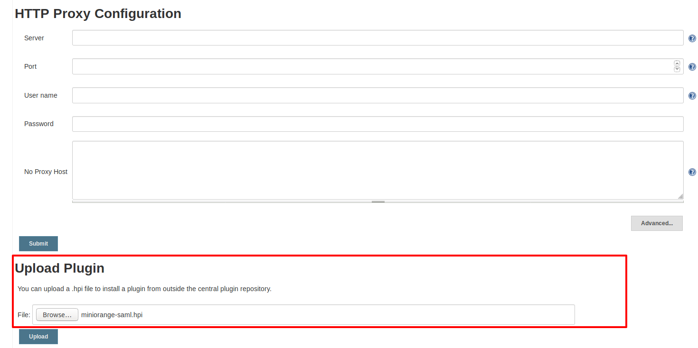
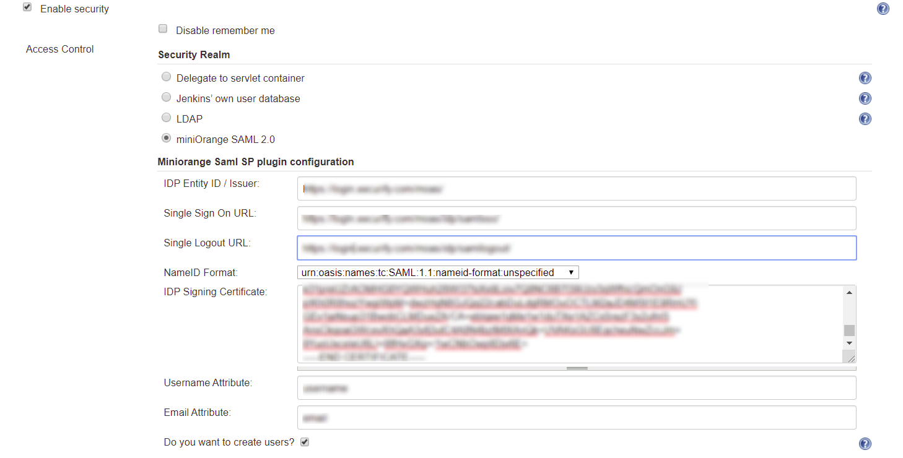

# Miniorange SAML Plugin for Jenkins
miniOrange SAML Single Sign On (SSO) plugin acts as a SAML Service Provider which can be configured to establish trust between the plugin and SAML capable Identity Providers to securely authenticate the user to the Jenkins.

Features of Jenkins Saml SP Plugin

* Simple and easy-to-use [ FREE ]
* Supports both SSO and Jenkins’ own login at the same time [FREE]
* Auto-create[only 10]/ Auto-login users in OctoberCMS [ FREE ]
* Auto-redirect to IdP[ PREMIUM ]
* Back-door Login [ PREMIUM ]
* Single Logout [ PREMIUM ]

Supported IDP’s:

We support all known IdPs - 
ADFS, Azure AD, Bitium, Centrify, Google Apps, IBM, NetIQ, Okta, OneLogin,  OpenAM, Oracle,  Ping,  RSA,  Salesforce, Shibboleth, SimpleSAMLphp, WSO2, etc.
In addition to the above, [miniOrange](/docs/images/miniorange_as_idp.md) also provides On-Premise IDP. 

[Okta SetupGuidelines](/docs/images/okta_as_idp.md)

 SAML Single Sign-on (SSO) acts as a SAML 2.0 Service Provider and securely authenticate users with your SAML 2.0 Identity Provider.

## On Jenkins side:

**Step 1: Download and install the plugin in Jenkins.**

To download the miniorange saml SP plugin follow the path:
**Through Jenkins plugin directory**
* Login to your Jenkins.
* Go to Manage Jenkins option from the left pane, and open Manage Plugins tab.

* Search for ‘Miniorange saml’ in the available tab.
* Download and install with a restart.

Or
**Manual Configuration:**
* Download the [miniorange_saml.hpi](https://drive.google.com/file/d/16GcJvM_BJ0kPZ9KgGZo0UnX4c19oL0LM/view?usp=sharing) plugin file.
* Login to your Jenkins.
* Go to Manage Jenkins option from the left pane, and open Manage Plugins tab.
* Go to the advanced tab and upload the hpi file.

**Step 2: To activate the plugin**

* Open Manage Jenkins => Configure Global Security and set the Security Realm as miniorange SAML 2.0.

            Make sure that Enable Security checkbox is checked.
            

**Step:3: Fill the required details of IDP and press apply and save the settings.**
* Fill the required details of IDP and press apply and save the settings.

